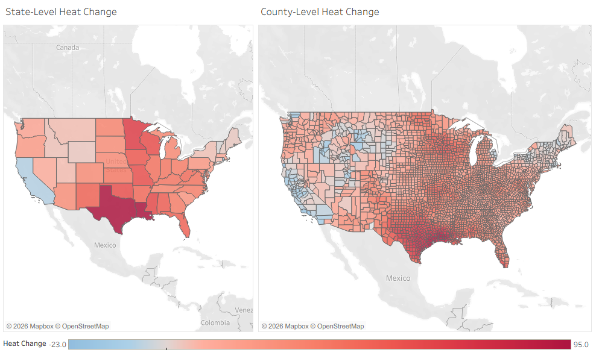

# Extreme Heat and Volatility in the Continental United States

Tableau analysis of county-level extreme heat, heat volatility, long-term heat change, and social vulnerability across the continental United States from 1979–2022.

## Project Links

- [View Interactive Tableau Story](https://public.tableau.com/app/profile/lauren.berg8826/viz/Extreme_Heat_and_Volatility_US_1979-2022/CapstonePresentation?publish=yes)

## Project Overview

This project examines how extreme heat exposure, year-to-year heat volatility, and long-term heat change have evolved across the continental United States and how these patterns relate to social vulnerability.

The analysis was completed entirely in Tableau and demonstrates multi-source data integration, geographic analysis, time-series analysis, statistical interpretation, and executive-level data visualization.

## Research Questions

- How has extreme heat exposure changed across the United States since 1979?
- How do heat patterns differ across regions, states, and counties?
- Where is extreme heat becoming more volatile or less predictable?
- What relationship exists between heat exposure and social vulnerability?
- Which areas show overlapping indicators of vulnerability, heat change, and volatility?

## Key Visualization

## Data

The analysis combines three primary public datasets:

1. **Extreme Heat Days — CDC National Environmental Public Health Tracking Network (1979–2022)**  
   County-level annual counts of extreme heat days.

2. **Social Vulnerability Index — CDC/ATSDR (2022)**  
   County-level composite measures of socioeconomic and demographic vulnerability.

3. **U.S. Census Regions**  
   Used to compare patterns across the Midwest, Northeast, South, and West.

The raw datasets are not included in this repository. Additional information about the sources and data integration is available in [data/README.md](data/README.md).

## Key Findings

- **Extreme heat exposure increased over the study period**, although patterns vary substantially by geography and from year to year.
- **The South showed some of the highest regional heat exposure and volatility.**
- The national county-level heat trend was statistically significant, although substantial variation remains unexplained by the overall trend.
- The forecast suggests continued increases in average county-level extreme heat exposure, reaching approximately **34 days by 2030**, with substantial uncertainty around future estimates.
- **Social vulnerability alone does not strongly explain county-level heat exposure**, but higher-SVI groups show greater long-term heat change and, in recent decades, greater volatility.
- Counties where high vulnerability overlaps with rapid heat change and high volatility may warrant particular attention in resilience planning.

## Analytical Approach

The Tableau analysis included:

- Multi-source dataset integration
- National and regional time-series analysis
- State- and county-level geographic comparisons
- Linear trend analysis and forecasting
- Heat-volatility analysis using variation in annual extreme heat-day counts
- Social Vulnerability Index comparison
- SVI quartile analysis
- County-level ranking of overlapping heat and vulnerability indicators

## Tools

- Tableau
- Data joins and relationships
- Calculated fields
- Geographic mapping
- Trend lines and forecasting
- Dashboard and Story design

## Limitations

- National values represent averages across county-level observations and may obscure substantial local variation.
- Forecasts are estimates based on historical patterns and include considerable uncertainty.
- Statistical relationships in this analysis indicate association rather than causation.
- Social vulnerability and extreme heat are influenced by many interacting geographic, demographic, environmental, and infrastructure factors.
